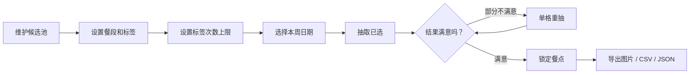
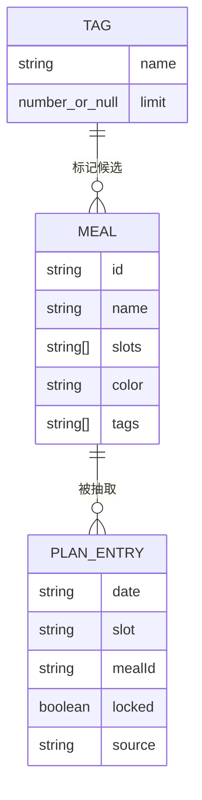
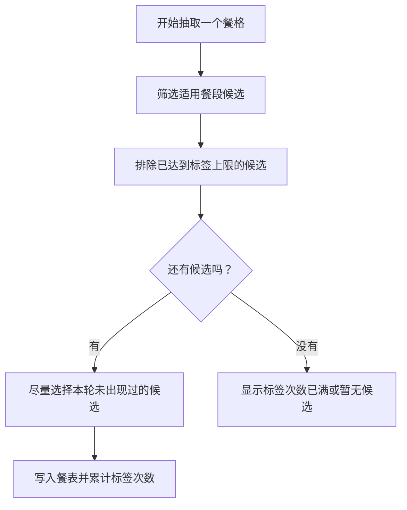

# 干饭机器

一个用于抽取本周早饭、午饭、晚饭的小桌面应用。适合维护自己的候选池，按标签控制出现次数，然后把抽取结果导出成图片、CSV 表格或 JSON。

## 快速使用

直接运行已打包好的便携版：

```text
dist/干饭机器-1.0.0.exe
```

打开后建议按这个顺序使用：

1. 在候选池添加饭店、菜品或“觅食区域”。
2. 给候选设置适用餐段，比如只晚饭可用，或午饭/晚饭都可用。
3. 给候选添加标签，默认是“普通干饭”。
4. 在“标签次数”里设置某类标签最多抽到几次；留空表示不限。
5. 选择本周要抽取的日期，点击“抽取已选”。
6. 对满意的餐点点击锁定，对单格不满意可以重抽。
7. 用顶部按钮导出图片、表格或完整 JSON。

## 功能图示

### 使用流程



### 数据关系



### 标签限制逻辑



## 目录结构

```text
干饭机器/
├─ app.js                         # 前端逻辑：抽取、标签限制、导入导出
├─ index.html                     # 页面结构
├─ styles.css                     # 页面样式
├─ main.js                        # Electron 桌面入口
├─ package.json                   # 运行和打包脚本
├─ package-lock.json              # 依赖锁定文件
├─ ganfan-meal-pool-2026-05-17.json # 已迁移到 v3 的候选池记录
├─ vendor/
│  └─ lucide.min.js               # 本地图标库，离线可用
└─ dist/
   └─ 干饭机器-1.0.0.exe          # 可直接分发的 Windows 便携版
```

`node_modules/`、`dist/win-unpacked/`、打包器调试配置和日志文件都属于可重新生成内容，已通过 `.gitignore` 排除。

## 候选池

每个候选包含：

```json
{
  "id": "meal-...",
  "name": "大米先生",
  "slots": ["lunch", "dinner"],
  "color": "#0033ff",
  "tags": ["普通干饭"]
}
```

餐段字段说明：

| 字段 | 含义 |
| --- | --- |
| `breakfast` | 早上 |
| `lunch` | 中午 |
| `dinner` | 晚上 |

可以保留同名候选的重复项。重复项会让该候选在随机抽取里拥有更高权重；点击“按名称自动分配颜色”后，同名候选会使用同一种颜色。

## 标签次数

默认标签是“普通干饭”，默认 `limit` 为 `null`，表示不限制。

示例：

```json
{
  "tags": [
    { "name": "普通干饭", "limit": null },
    { "name": "外卖", "limit": 2 },
    { "name": "清淡", "limit": 4 }
  ]
}
```

抽取时，已锁定的餐点也会计入标签次数。比如“外卖”限制为 2 次，餐表里已经锁定了 1 次外卖，那么后续本轮抽取最多再出现 1 次外卖。

## 导入导出

### 候选池 JSON

候选池导入/导出用于备份饭店和菜品。当前格式版本是 `version: 3`。

本目录里的旧记录已经迁移完成：

```text
ganfan-meal-pool-2026-05-17.json
```

### 抽取结果图片

点击顶部图片按钮会导出当前餐表 PNG，适合发给别人看。

### 抽取结果 CSV

点击顶部表格按钮会导出 CSV，列包含：

| 列名 | 说明 |
| --- | --- |
| 日期 | 本周日期 |
| 星期 | 周一到周日 |
| 餐段 | 早上/中午/晚上 |
| 名称 | 抽到的候选 |
| 标签 | 以 `|` 分隔 |
| 颜色 | 十六进制颜色 |
| 来源 | 抽取、导入等 |
| 锁定 | 是/否 |

### 完整结果 JSON

点击顶部 JSON 按钮会导出当前标签、候选池和餐表结果，适合完整迁移。

### 导入结果

导入结果支持 JSON 或 CSV。导入时，程序会读取餐表结果，并把其中尚不存在的候选自动加入候选池。

## 本地开发

首次运行需要安装依赖：

```powershell
npm install
```

启动桌面应用：

```powershell
npm start
```

也可以直接用浏览器打开 `index.html` 查看静态页面。

## 打包 exe

生成 Windows 便携版：

```powershell
npm install
npm run build
```

打包完成后会生成：

```text
dist/干饭机器-1.0.0.exe
```

如果需要重新打包，`node_modules/` 和 `dist/win-unpacked/` 都可以重新生成，不需要手动保存。
